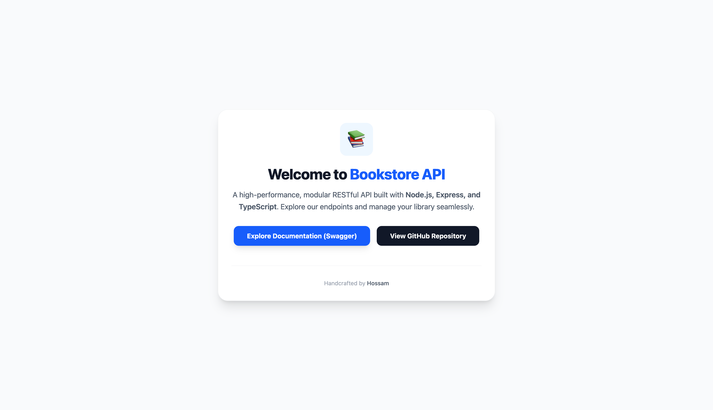

# 📚 Bookstore API (V2)

[](https://github.com/HossamGezo/ts-bookstore-api-v2/actions)
[](https://bookstore-api-0fy2.onrender.com)

[](https://bookstore-api-0fy2.onrender.com/api-docs)
[](https://hub.docker.com/r/hossamgezo/bookstore-api)
[](https://github.com/HossamGezo/ts-bookstore-api-v2/blob/main/LICENSE)

---

A professional, high-performance Bookstore system featuring a hybrid **RESTful API** and **MVC architecture**, built with **Node.js**, **Express**, and **TypeScript**. This project implements **Clean Modular Architecture**, robust production security, and a fully automated **CI/CD Pipeline**.

🚀 **Live Site:** [https://bookstore-api-0fy2.onrender.com](https://bookstore-api-0fy2.onrender.com)

---

## 📸 Project Showcase

### 🏠 Landing Page (MVC with EJS & Tailwind)

_Click the image to visit the live home page._

[](https://bookstore-api-0fy2.onrender.com)

---

### 📖 Interactive API Explorer (Swagger UI)

_Click the image to test the API endpoints live._

[](https://bookstore-api-0fy2.onrender.com/api-docs)

---

## 🛠 Tech Stack

| Backend Core                                                                                      | Database                                                                                                      | DevOps & CI/CD                                                                                                      | Security & Performance                                                                                   |
| :------------------------------------------------------------------------------------------------ | :------------------------------------------------------------------------------------------------------------ | :------------------------------------------------------------------------------------------------------------------ | :------------------------------------------------------------------------------------------------------- |
|  |    |                         |  |
|    |             |  |                       |
|                |  |                         |              |

---

## ✨ Key Features & Architecture

### 🏗️ Architecture & Clean Code

- **Modular Design**: Fully organized by features (**Auth, Users, Books, Authors**) for maximum scalability.
- **Hybrid Pattern**: Combination of **REST API** for data exchange and **MVC** (using EJS & Tailwind) for user workflows.
- **Service Layer**: Business logic is decoupled from controllers using a standardized **Result Object Pattern**.
- **Global Data Transformation**: Automated MongoDB `_id` to `id` transformation via a custom global plugin.

### 🔐 Security & Reliability

- **Production Hardening**: Protected by `helmet`, `hpp`, and `compression`.
- **Rate Limiting**: Throttling requests per IP to prevent DDoS and Brute-force attacks.
- **Authentication**: Secure JWT-based auth with Role-Based Access Control (RBAC).
- **Validation**: Strict schema validation using **Zod** for both Body and Query parameters.

### ⚡ Performance & Automation

- **CI/CD Pipeline**: Fully automated **GitHub Actions** that build and push Docker images to **Docker Hub** on every main push.
- **Optimized Queries**: Advanced Pagination and Filtering helper using `Promise.all` for parallel database execution.
- **Multi-stage Docker**: Extremely small and secure production images using Alpine Linux.

---

## 🚀 Getting Started

### 🐳 Run with Docker (The Easiest Way)

Launch the entire environment (API + Database) with a single command:

```bash
# 1. Clone the repository
git clone https://github.com/HossamGezo/ts-bookstore-api-v2.git
cd ts-bookstore-api-v2

# 2. Setup your environment variables
cp .env.example .env

# 3. Start the application
docker-compose up -d
```

### 💻 Local Development

```bash
# 1. Install dependencies
npm install

# 2. Start dev server with type checking and tailwind watch
npm run dev
# OR for MVC development:
npm run mvc
```

---

## 📂 Internal Resources

- 📊 **Roadmap**: Check [TODO.md](./TODO.md) for future features.
- 📓 **Engineering Notes**: Detailed technical decisions and troubleshooting in [DEV_NOTES.md](./DEV_NOTES.md).

---

## 👨‍💻 Author

**Hossam Gezo**

- GitHub: [@HossamGezo](https://github.com/HossamGezo)
- LinkedIn: [Your LinkedIn Profile URL]

---

_Developed with focus on Clean Architecture and Modern DevOps Practices._
