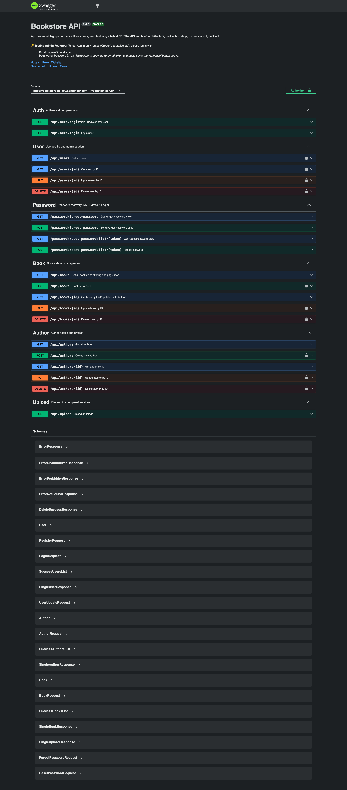

# 📚 Bookstore API (V2)

[](https://github.com/HossamGezo/ts-bookstore-api-v2/actions)
[](https://bookstore-api-0fy2.onrender.com)
[](https://bookstore-api-0fy2.onrender.com/api-docs)
[](https://hub.docker.com/r/hossamgezo/bookstore-api)
[](https://github.com/HossamGezo/ts-bookstore-api-v2/blob/release/prod-ready/LICENSE)

---

A professional, high-performance RESTful API for a Bookstore management system. Built with **Node.js**, **Express**, and **TypeScript**, this project implements **Clean Architecture (Modular)**, robust security, a fully automated **CI/CD Pipeline**, and an **MVC pattern** for specialized workflows.

🚀 **Live Demo:** [Interactive Swagger Documentation](https://bookstore-api-0fy2.onrender.com/api-docs)

---

## 🛠 Tech Stack

| Backend Core                                                                                      | Database                                                                                                    | DevOps & CI/CD                                                                                                      | Security & Performance                                                                                   |
| :------------------------------------------------------------------------------------------------ | :---------------------------------------------------------------------------------------------------------- | :------------------------------------------------------------------------------------------------------------------ | :------------------------------------------------------------------------------------------------------- |
|  |  |                         |  |
|    |           |  |                       |
|                |                                                                                                             |                         |              |

---

## ✨ Key Features & Architecture

### 🏗️ Architecture & Clean Code

- **Modular Design**: Organized by features (**Auth, Users, Books, Authors**) for maximum maintainability.
- **Hybrid Pattern**: A powerful combination of **REST API** for data and **MVC** (using EJS) for password recovery flows.
- **Standardized Responses**: Consistent JSON structure across all API endpoints using custom response helpers.

### 🔐 Security & Reliability

- **Rate Limiting & Protection**: Protects against DDoS/Brute-force via `express-rate-limit`, `hpp`, and `helmet`.
- **Authentication**: Secure JWT-based auth with specialized middlewares for Admin and Account Owners.
- **Data Integrity**: Strict request validation using **Zod** schemas.

### ⚡ Performance Optimization

- **Payload Compression**: Uses Gzip compression to speed up data transfer.
- **Smart Querying**: Built-in support for Pagination, Filtering, and MongoDB Population.

---

## 📸 API Documentation Preview



---

## 🚀 Installation & Running

### 🐳 Using Docker (Recommended)

```bash
# 1. Clone & Setup .env
git clone https://github.com/HossamGezo/ts-bookstore-api-v2.git
cd ts-bookstore-api-v2

# 2. Run with one command
docker-compose up
```

### 💻 Local Development Setup

1. **Install dependencies**: `npm install`
2. **Choose your mode**:
   - **`npm run dev`**: Start the **API** development server.
   - **`npm run mvc`**: Start the **Full Stack** development (API + Tailwind CSS Watcher + Views).

---

## 📂 Internal Resources

- 📊 **Roadmap**: Check [TODO.md](./TODO.md) for future features.
- 📓 **Engineering Notes**: Detailed troubleshooting and technical decisions in [DEV_NOTES.md](./DEV_NOTES.md).

---

## 👨‍💻 Author

**Hossam Gezo**

- GitHub: [@HossamGezo](https://github.com/HossamGezo)
- LinkedIn: [Your LinkedIn Profile URL]
